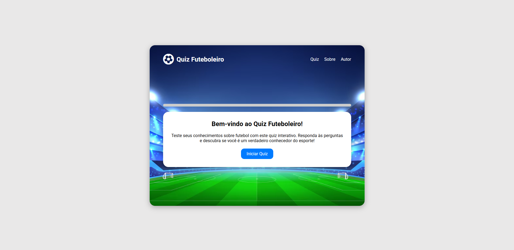

# Quiz de Futebol ⚽

Um quiz interativo feito com HTML, CSS e JavaScript puro, com foco em perguntas sobre o mundo do futebol. Ideal para testar conhecimentos de forma divertida e prática!

## 🔍 Funcionalidades

- Exibição de perguntas uma por vez
- Validação automática ao selecionar uma opção
- Barra de progresso que avança conforme o usuário responde
- Exibição de pontuação final e lista de perguntas erradas
- Opção de reiniciar o quiz

## 🧠 Tecnologias utilizadas

- HTML5
- CSS3
- JavaScript (Vanilla JS)

## 🚀 Como executar

1. Clone o repositório:

   ```bash
   git clone https://github.com/seu-usuario/nome-do-repo.git

   ```

2. Acesse a pasta do projeto:

   ```bash
   cd nome-do-repo

   ```

3. Abra o index.html no seu navegador ou use uma extensão como "Live Server" no VS Code.

## ✨ Preview


